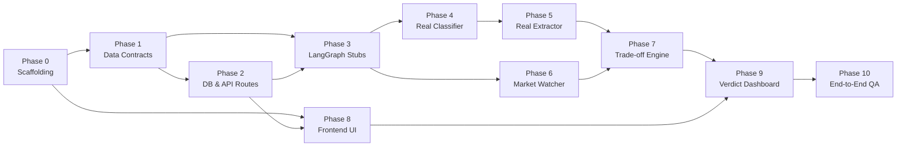

# FinLens — Project Master Plan (`PLAN.md`)

> A complete, phase-by-phase blueprint to build **FinLens** (Comparative Financial-Document Auditor) from zero to a demo-ready MVP.
> Each phase is independently testable and demoable.

---

## 🎯 Project Overview & Core Bet

- **What it is:** A tool where users upload **2–5 competing financial offers** (home loans, insurance policies), answer **4 quick profile questions**, and get a **plain-English, source-cited, personalized verdict** on which offer fits them best.
- **Core Architecture:** Stateful **LangGraph** pipeline with 4 modular nodes:
  1. `Classifier` (Tags doc: "loan" vs "insurance")
  2. `Extractor` (Pydantic-enforced extraction with exact source citations)
  3. `Market Watcher` (Live Tavily search + curated fallback table)
  4. `Trade-off Engine` (Personalized 0–100 scoring & conditional recommendations)
- **Tech Stack:**
  - **Backend:** FastAPI (Python, async), LangGraph, Pydantic, SQLAlchemy/SQLite, PyMuPDF
  - **Frontend:** React + TypeScript (Vite), Modern Dark/Glassmorphic UI
  - **AI / Services:** Claude (Anthropic API), Tavily API

---

## 🗺️ 10-Phase Roadmap

---

### Phase 0: Project Scaffolding & Environment Setup
- [x] Backend directory structure (`app/`, `graph/`, `schemas/`, `db/`, `api/`)
- [x] Virtual environment & dependencies (`requirements.txt`)
- [x] Frontend initialized with Vite + React + TypeScript + npm install
- [x] Configuration & environment templates (`.env.example`, `config.py`)
- [x] Baseline fallback data (`data/market_reference.json`)

---

### Phase 1: Data Contracts (Pydantic Schemas)
- [ ] Define strict schemas in `backend/app/schemas/models.py`:
  - `DocumentType` (loan, insurance)
  - `UserProfile` (age, income, EMIs, risk appetite, primary goal)
  - `LoanExtraction` (interest rate, type, tenure, processing fee, prepayment penalty, foreclosure fee, source snippet)
  - `InsuranceExtraction` (premium, coverage, exclusions, claim ratio, lock-in, source snippet)
  - `MarketBenchmark` (metric name, current value, source URL, fetched via)
  - `MatchResult` (score 0–100, breakdown, highlights, conditional verdict)
  - `AnalysisRequest` & `AnalysisResponse`
- [ ] Define `GraphState` TypedDict in `backend/app/graph/state.py`
- [ ] Write unit tests for schema validation

---

### Phase 2: Database & API Routes (Skeleton)
- [ ] SQLAlchemy models in `backend/app/db/models.py`:
  - `UploadedDocument`, `AnalysisSession`, `AnalysisResult`
- [ ] FastAPI routes in `backend/app/api/routes.py`:
  - `POST /api/upload`: Upload 2–5 PDFs, save to `data/uploads/`
  - `POST /api/profile`: Save user profile
  - `POST /api/analyze`: Trigger analysis
  - `GET /api/results/{session_id}`: Fetch session results
- [ ] Enable CORS middleware for frontend

---

### Phase 3: LangGraph Pipeline (Stub Nodes)
- [ ] Build `StateGraph` in `backend/app/graph/pipeline.py`
- [ ] Connect 4 stub nodes: `Classifier -> Extractor -> MarketWatcher -> TradeoffEngine`
- [ ] Verify data flows end-to-end through the graph and returns via the API

---

### Phase 4: Classifier Node (Real AI Logic)
- [ ] Implement PDF text extraction using `pymupdf` in `backend/app/utils/pdf_reader.py`
- [ ] Create classifier prompt in `docs/agent_prompts/classifier.md`
- [ ] Call Claude to classify document into `loan` or `insurance` with confidence score
- [ ] Test with sample loan and insurance PDFs

---

### Phase 5: Extractor Node (Real AI Logic)
- [ ] Create extraction prompts:
  - `docs/agent_prompts/extractor_loan.md`
  - `docs/agent_prompts/extractor_insurance.md`
- [ ] Extract structured Pydantic models using Claude tool calling / structured output
- [ ] Enforce that every extracted numeric value includes an exact `source_snippet` citation

---

### Phase 6: Market Watcher Node (Live Data + Fallback)
- [ ] Integrate Tavily Search API to query live interest rates & insurance premiums
- [ ] Build validation layer (sanity checks for rate ranges)
- [ ] Add graceful fallback to `data/market_reference.json` when search fails or key is missing
- [ ] Tag output with `fetched_via: "live_search" | "fallback_table"`

---

### Phase 7: Trade-off Engine Node (Personalized Scoring)
- [ ] Implement multi-factor scoring rubric (0–100) based on user profile and primary goal
- [ ] Trade-off generation prompt in `docs/agent_prompts/tradeoff_engine.md`
- [ ] Output structured `MatchResult` with score breakdown, key trade-offs, and conditional recommendations ("Choose A if... Choose B if...")

---

### Phase 8: Frontend — Upload, Profile & App Shell
- [ ] Design system tokens (Dark mode, glassmorphism, typography, accent colors)
- [ ] `UploadZone` component (drag-and-drop 2–5 PDFs, file validation)
- [ ] `ProfileForm` component (4 questions: age, income+EMIs, risk slider, goal dropdown)
- [ ] `Stepper` progress indicator
- [ ] API client integration (`src/api/client.ts`)

---

### Phase 9: Frontend — Verdict Dashboard
- [ ] `MatchScoreCard` (circular score gauge 0–100, color-coded)
- [ ] `ScoreBreakdown` (score dimensions bar chart)
- [ ] `TradeoffTable` (side-by-side feature comparison)
- [ ] `VerdictPanel` (conditional recommendation banner)
- [ ] `SourceTrace` (interactive snippet preview showing exact PDF proof)
- [ ] `MarketBenchmarkBadge` (market comparisons)

---

### Phase 10: End-to-End Integration, QA & Demo
- [ ] Test complete flow: Upload 3 loans + 1 insurance doc -> Profile -> Analyze -> Dashboard
- [ ] Error handling (scanned PDFs, network timeout, corrupted files)
- [ ] Complete setup documentation (`README.md`)
- [ ] Final demo walkthrough script

---

## 📋 Ground Rules
1. **Source-Linked Numbers:** Every figure shown in the dashboard must trace back to the PDF or live market data.
2. **Conditional Verdicts:** The AI never gives absolute advice ("Pick A"), but conditional advice ("Pick A if you want early prepayment; Pick B for lower EMIs").
3. **Modular Expansion:** New financial document types (property, mutual funds) are added as modular graph nodes without rewriting the core engine.
